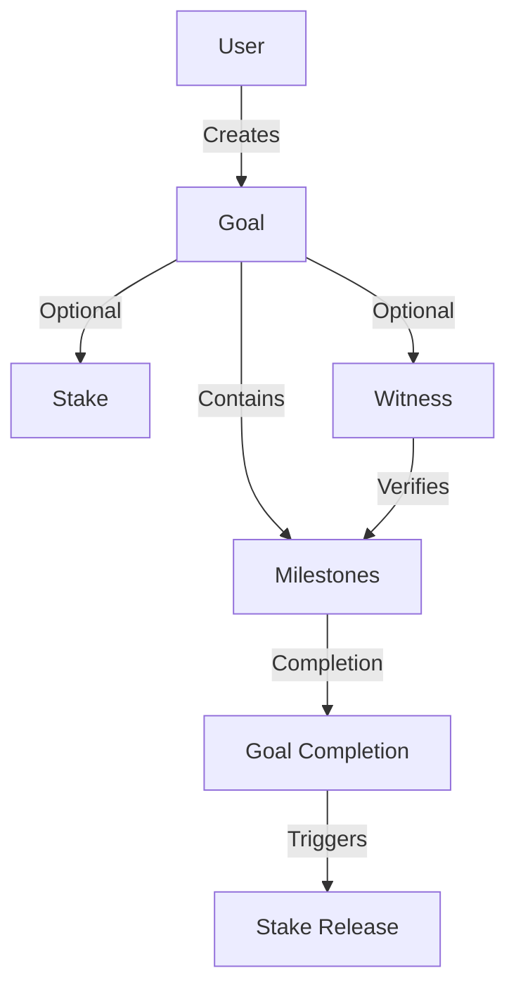

# Discrete Milestone Tracker

A blockchain-based personal goal tracking system built on Stacks, enabling users to create, manage, and verify progress on their personal goals with optional staking and third-party verification.

## Overview

Discrete Milestone Tracker leverages blockchain technology to provide a transparent and immutable goal tracking platform. Users can:

- Create personal goals with specific metrics and deadlines
- Break down goals into verifiable milestones
- Stake tokens to increase commitment
- Assign "witnesses" for third-party verification
- Track progress in a transparent way
- Choose between public and private goal visibility

## Architecture



The system is built around two main data structures:
- Goals: Track high-level goal information and metadata
- Milestones: Track individual steps toward goal completion

## Contract Documentation

### Core Components

#### Goals Map
Stores goal information including:
- Title and description
- Deadline
- Privacy settings
- Witness address
- Stake amount
- Milestone completion tracking

#### Milestones Map
Tracks individual milestones with:
- Title and description
- Completion status
- Verification details
- Completion timestamp

### Key Features

1. **Goal Privacy**
   - Public goals visible to all
   - Private goals visible only to owner and witness

2. **Staking Mechanism**
   - Optional token staking
   - Tokens released upon goal completion

3. **Witness System**
   - Optional third-party verification
   - Witnesses must verify milestone completion

## Getting Started

### Prerequisites
- Clarinet
- Stacks wallet
- STX tokens (for staking)

### Basic Usage

1. Create a new goal:
```clarity
(contract-call? .pathpulse create-goal 
    "Learn Clarity" 
    "Master Clarity smart contract development" 
    (some u144000) ;; Deadline
    u1 ;; Public
    none ;; No witness
    u100) ;; Stake 100 STX
```

2. Add a milestone:
```clarity
(contract-call? .pathpulse add-milestone 
    u1 
    "Complete basic tutorial" 
    "Finish the Clarity basics tutorial")
```

3. Complete a milestone:
```clarity
(contract-call? .pathpulse complete-milestone u1 u1)
```

## Function Reference

### Goal Management

```clarity
(create-goal (title (string-ascii 100)) 
            (description (string-utf8 500))
            (deadline (optional uint))
            (privacy uint)
            (witness (optional principal))
            (stake-amount uint))

(add-milestone (goal-id uint)
              (title (string-ascii 100))
              (description (string-utf8 500)))

(complete-milestone (goal-id uint) (milestone-id uint))

(verify-milestone (user principal) (goal-id uint) (milestone-id uint))
```

### Goal Administration

```clarity
(update-goal-privacy (goal-id uint) (privacy uint))
(update-goal-witness (goal-id uint) (witness (optional principal)))
(claim-stake (goal-id uint))
```

## Development

### Testing
1. Install Clarinet
2. Run tests:
```bash
clarinet test
```

### Local Development
1. Start Clarinet console:
```bash
clarinet console
```

2. Deploy contract:
```bash
clarinet deploy
```

## Security Considerations

### Known Limitations
- Goal deadlines are based on block height
- Witnesses cannot be changed after milestone verification begins
- No partial stake withdrawal

### Best Practices
- Always verify goal privacy settings before sharing sensitive information
- Use witnesses for important goals requiring verification
- Set realistic deadlines (in block height)
- Consider token stake amounts carefully
- Review goal and milestone details before creation as they cannot be modified